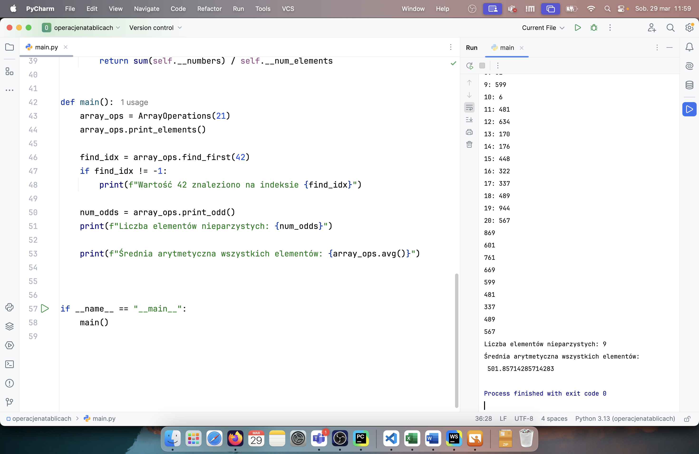
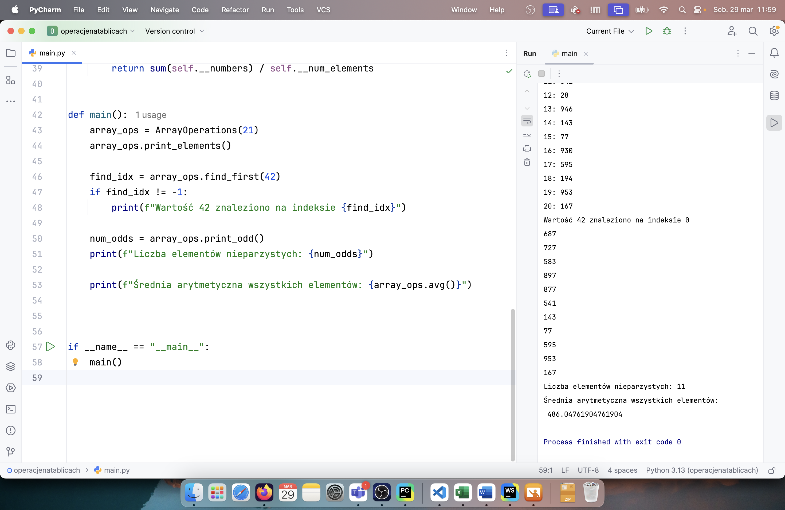
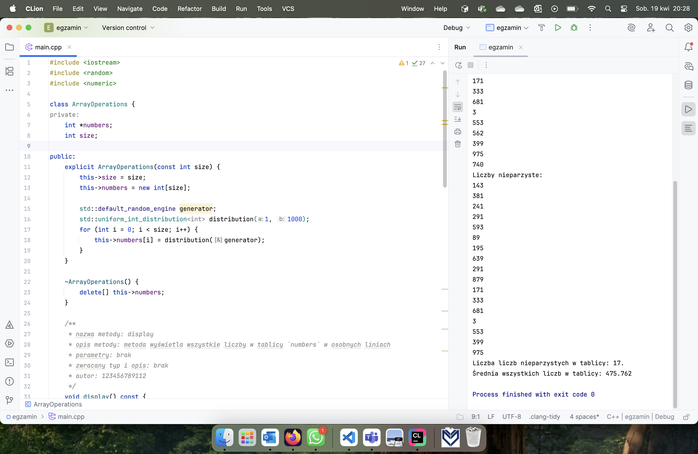
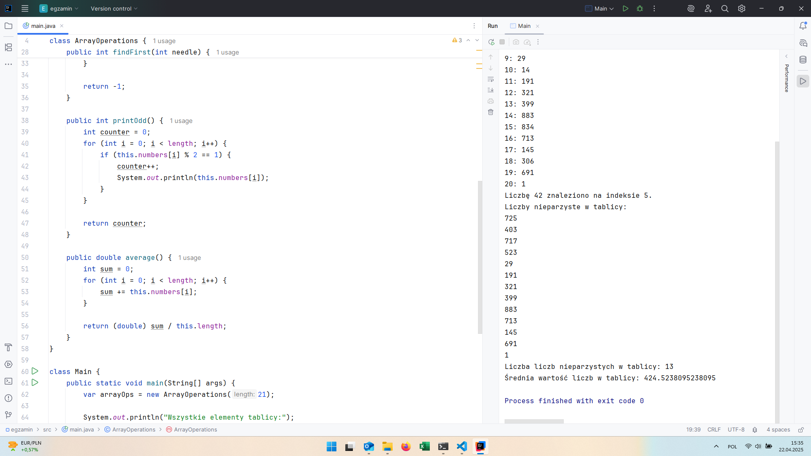
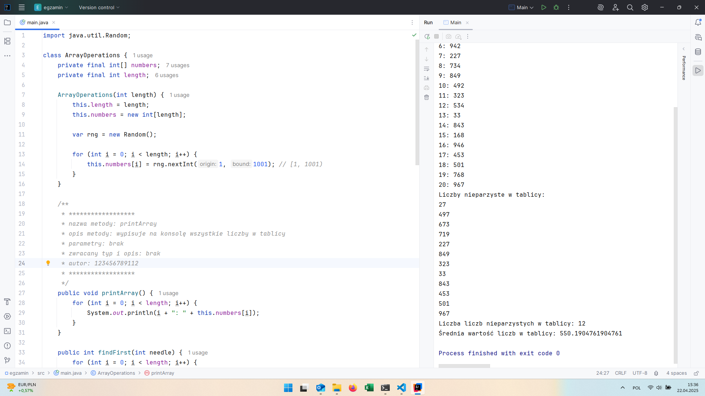
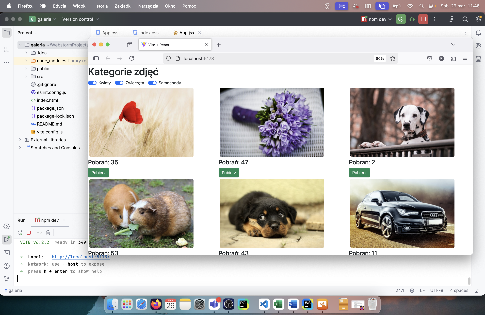
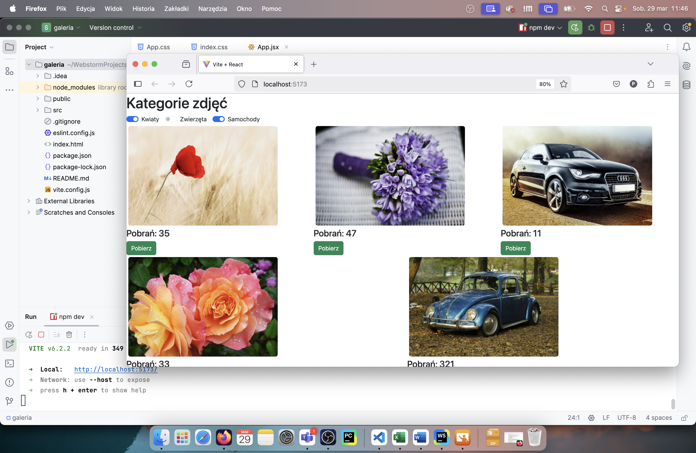
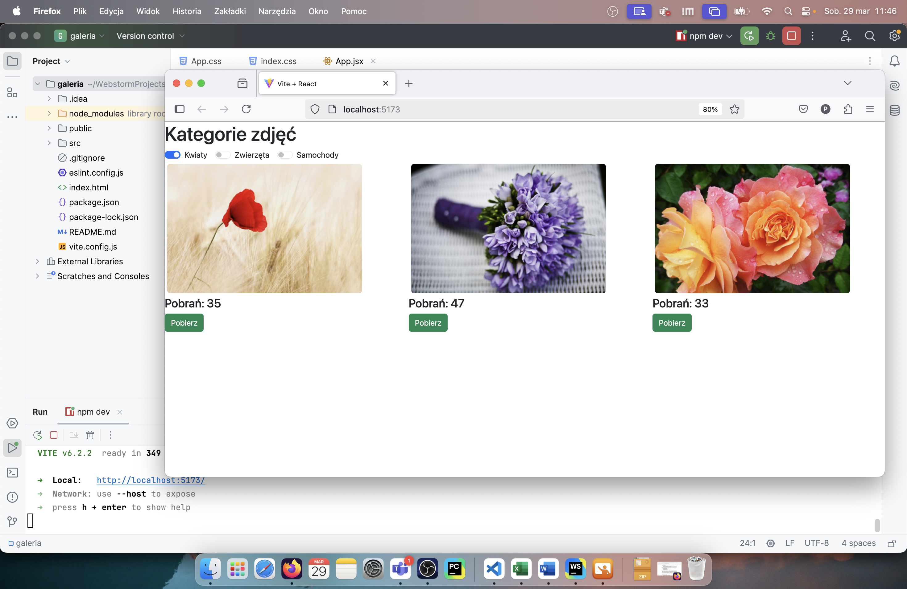
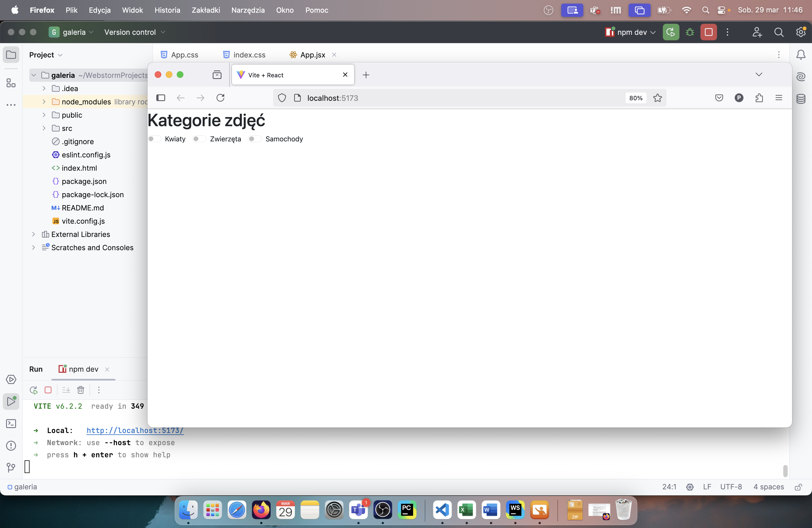
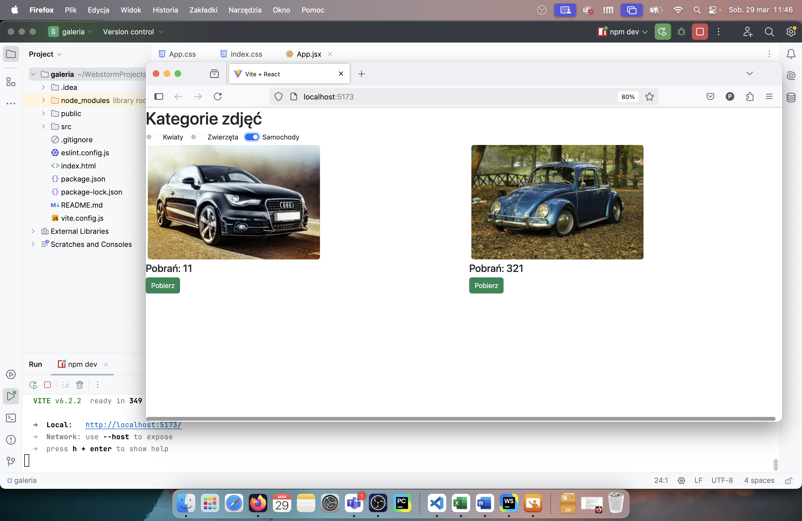

# INF.04-01-25.01-SG

## Informacje o rozwiązaniu

System operacyjny: macOS Sequoia 15.3.2, Windows 11 Pro

Środowiska programistyczne: PyCharm 2024.2.5 Professional Edition, WebStorm 2024.3.1, CLion 2025.1, IntelliJ IDEA 2025.1 (Ultimate Edition), Visual Studio 2022 (17)

Języki programowania: Python 3.13, JavaScript, C++ 26, Java (OpenJDK 24), C#

## Aplikacja konsolowa

### Rozwiązanie w Pythonie

### Rozwiązanie w C++26

### C#
.png)

.png)

### Rozwiązanie w Javie

## Aplikacja webowa

